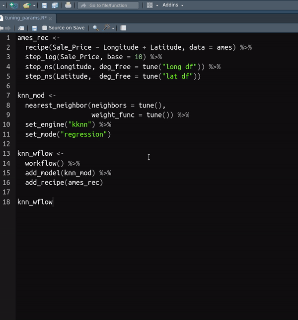

<!-- README.md is generated from README.Rmd. Please edit that file -->

# TuningParams

`TuningParams` addin inserts code for updating tuning parameters related
to `tidymodels` packages. Addin extracts parameters from `model_spec`,
`recipe` and `workflow` class objects.

## Installation

You can install addin from GitHub with:

``` r
# install.packages("remotes")
remotes::install_github("milosvil/TuningParams")
```

## Step by step guide

**Step 1:** Highlight object of class `model_spec`, `recipe` or
`workflow`

**Step 2:** Run `TuningParams` addin from *Addins* dropdown menu.


